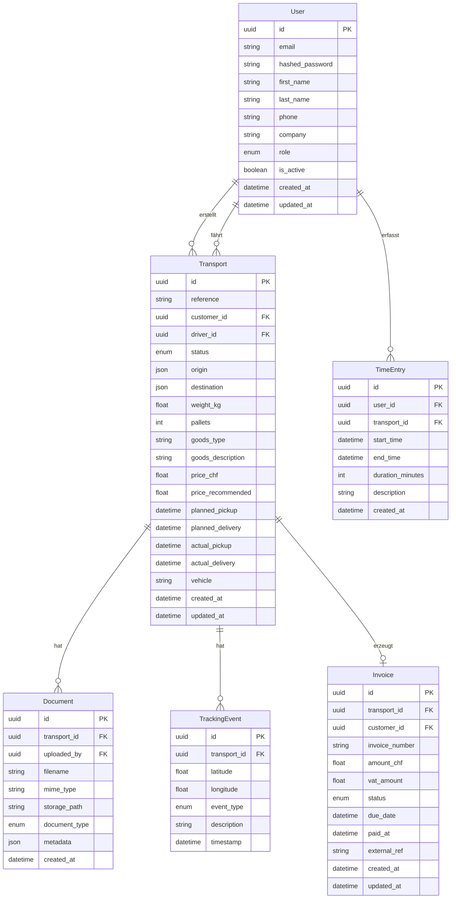

# Datenmodell: SWISS-CONNECT

**Version:** 1.0

---

## Übersicht

Das Datenmodell bildet die Kernentitäten der Transportplattform ab. Alle Tabellen verwenden UUIDs als Primärschlüssel und beinhalten Audit-Felder (`created_at`, `updated_at`).

## Entity-Relationship-Diagramm

## Enumerationen

### UserRole
| Wert | Beschreibung |
|------|-------------|
| `admin` | Systemadministrator |
| `dispatcher` | Disponent / Auftraggeber |
| `driver` | Fahrer |
| `viewer` | Nur-Lese-Zugriff |

### TransportStatus
| Wert | Beschreibung |
|------|-------------|
| `pending` | Auftrag erstellt, wartet auf Annahme |
| `accepted` | Fahrer hat angenommen |
| `picked_up` | Ware abgeholt |
| `in_transit` | Unterwegs |
| `delivered` | Zugestellt |
| `cancelled` | Storniert |
| `archived` | Archiviert |

### TrackingEventType
| Wert | Beschreibung |
|------|-------------|
| `location_update` | GPS-Positionsupdate |
| `status_change` | Statusänderung |
| `geofence_enter` | Geofence betreten |
| `geofence_exit` | Geofence verlassen |

### DocumentType
| Wert | Beschreibung |
|------|-------------|
| `cmr` | CMR-Frachtbrief |
| `invoice` | Rechnung |
| `pod` | Proof of Delivery |
| `customs` | Zolldokument |
| `other` | Sonstiges |

### InvoiceStatus
| Wert | Beschreibung |
|------|-------------|
| `draft` | Entwurf |
| `sent` | Versendet |
| `paid` | Bezahlt |
| `overdue` | Überfällig |
| `cancelled` | Storniert |

---
