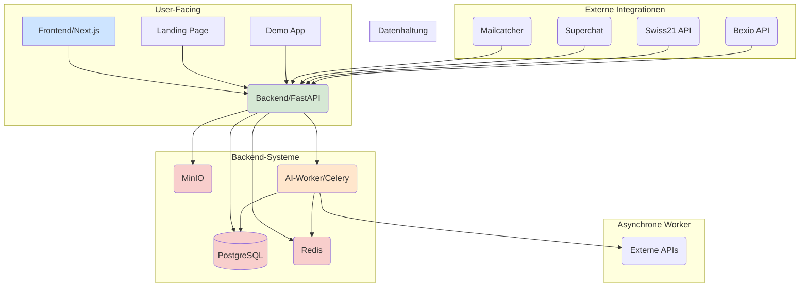

# Architekturübersicht: SWISS-CONNECT

**Version:** 1.0
**Status:** Abgeschlossen

---

## 1. Leitprinzipien

Die Architektur von SWISS-CONNECT basiert auf den folgenden Prinzipien:

- **Modularität und Serviceorientierung:** Jeder Service hat eine klar definierte Aufgabe und kommuniziert über stabile APIs. Dies fördert die unabhängige Entwicklung, Skalierbarkeit und Wartbarkeit.
- **Container-First:** Alle Services werden in Docker-Containern entwickelt und betrieben. `docker-compose.yml` ist die zentrale Definition für die lokale Entwicklungsumgebung.
- **GitHub als Source of Truth:** Die `/docs` im Repository sind die primäre Quelle für Architekturentscheidungen, API-Spezifikationen und Betriebsanleitungen. Code wird erst geschrieben, wenn die Dokumentation steht.
- **API-First:** Das System wird von der API her gedacht. Das Backend stellt eine robuste API bereit, die von verschiedenen Clients (Frontend, Mobile App, externe Partner) genutzt werden kann.
- **Asynchrone Verarbeitung:** Langlaufende oder rechenintensive Aufgaben (z.B. KI-Analysen, Reportings, E-Mail-Verarbeitung) werden über einen Background-Worker (Celery) asynchron abgewickelt, um die API-Antwortzeiten schnell zu halten.

## 2. Systemlandschaft

Die Systemlandschaft besteht aus mehreren lose gekoppelten Services, die über ein gemeinsames Netzwerk kommunizieren.

## 3. Service-Beschreibung

| Service | Technologie | Beschreibung |
|---------|-------------|-------------|
| **Frontend** | Next.js (React), TypeScript | Benutzeroberfläche für Kunden und Fahrer. Kommuniziert ausschließlich über die Backend-API. |
| **Demo** | React, Vite, Leaflet | Interaktive Showcase-Anwendung mit Kartendarstellung und simulierten Transportaufträgen. |
| **Landing Page** | React, Vite, GSAP | Marketing-Seite mit Produktpräsentation, Animationen und Kontaktformular. |
| **Backend** | FastAPI (Python) | Zentraler API-Server für Geschäftslogik, Authentifizierung, Datenvalidierung und Service-Orchestrierung. |
| **PostgreSQL** | PostgreSQL 16 | Primäre relationale Datenbank für alle Kerndaten (Transporte, Benutzer, Rechnungen etc.). |
| **Redis** | Redis 7 | In-Memory-Cache für häufig abgerufene Daten und Message Broker für Celery. |
| **MinIO** | MinIO (S3-API) | Object Storage für binäre Daten wie Dokumente (CMRs, Rechnungen) und Bilder. |
| **AI-Worker** | Celery (Python) | Asynchrone Tasks: E-Mail-Verarbeitung, Dokumenten-Klassifizierung, Preisempfehlungen. |
| **Superchat-Adapter** | FastAPI (Python) | Empfängt Webhooks von Superchat und leitet Nachrichten an den AI-Worker weiter. |

## 4. Datenfluss-Beispiele

### a) Transport erstellen

1. **Frontend:** Der Benutzer füllt das Formular aus und sendet die Daten an das Backend.
2. **Backend:** Empfängt den Request, validiert die Daten, authentifiziert den Benutzer und speichert den neuen Transport in PostgreSQL mit dem Status `pending`.
3. **Backend:** Sendet eine Bestätigung an das Frontend zurück.
4. **Backend:** Erstellt einen asynchronen Task in Redis, um Fahrer über den neuen Auftrag zu benachrichtigen. Dieser Task wird vom AI-Worker ausgeführt.

### b) Dokument per E-Mail empfangen

1. Eine E-Mail mit einem PDF-Anhang geht an `docs@swiss-connect.ch` ein.
2. **AI-Worker:** Prüft das Postfach, lädt den Anhang herunter und speichert ihn in MinIO.
3. **AI-Worker:** Analysiert das Dokument (OCR, Klassifizierung).
4. **AI-Worker:** Speichert die extrahierten Metadaten in PostgreSQL und verknüpft sie mit dem entsprechenden Transport.
5. **Frontend:** Der Benutzer sieht das neue Dokument in der Transport-Detailansicht.

### c) Preisempfehlung generieren

1. **Backend:** Ein neuer Transport wird erstellt.
2. **Backend:** Erstellt einen Celery-Task für die Preisanalyse.
3. **AI-Worker:** Analysiert historische Daten, Strecke, Gewicht und Marktbedingungen.
4. **AI-Worker:** Speichert die Empfehlung in PostgreSQL.
5. **Frontend:** Der Benutzer sieht die Preisempfehlung im Auftragsformular.

---
